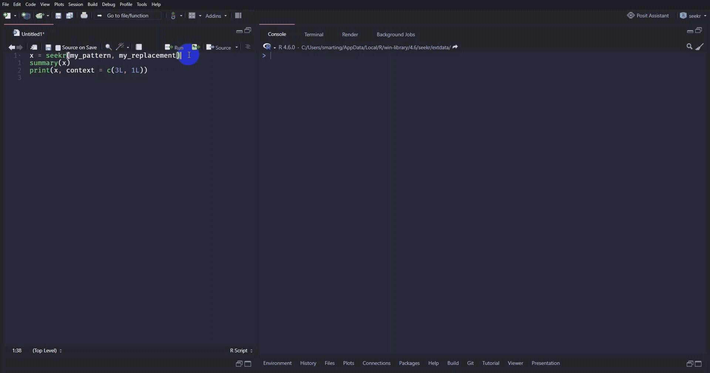

<!-- README.md is generated from README.Rmd. Please edit that file -->

# seekr <a href="https://smartiing.github.io/seekr/"></a>

<!-- badges: start -->

[](https://CRAN.R-project.org/package=seekr)
[](https://github.com/smartiing/seekr/actions/workflows/R-CMD-check.yaml)
[](https://app.codecov.io/gh/smartiing/seekr)
<!-- badges: end -->

## Overview

`seekr` turns search-and-replace into an inspectable R workflow.

Instead of modifying files as soon as a pattern is found, `seekr`
returns a `seekr_match` vector. Each element represents one match in one
file and stores its location, matched text, surrounding context lines,
and optional replacement.

You can keep working with that vector after the search: inspect the
result, remove unwanted matches, and define or revise the replacement
associated with each remaining match. When you are ready, only those
matches are written back to disk.

The [Design choices
article](https://smartiing.github.io/seekr/articles/design-choices.html)
explains why `seekr` uses this representation and how it makes safe
replacement possible.

In real projects, search-and-replace often raises questions beyond
finding a pattern: Which files were considered? Which files were
excluded, and why? Which matches were found? Which replacements will be
applied? Can I keep only some matches? Can I restore the previous file
contents if needed?

`seekr` provides a set of functions that make this workflow explicit,
composable, and safe:

- **List files** with `list_files()`. Start from one or more
  directories, recurse into subdirectories, optionally restrict
  discovery with Git, and get a normalized character vector of file
  paths.
- **Filter files** with `filter_files()`. Keep files by extension, path
  pattern, or size, and use a sensible default set of exclude functions
  to remove files that should not be searched.
- **Understand exclusions** with `exclusions()`. Inspect which files
  were excluded and why, instead of silently excluding files by mistake.
- **Match patterns** with `match_files()`, or use `seek()` to combine
  listing, filtering, and matching in one call. Replacements can be
  literal strings, backreferences, functions, or functions that operate
  on the capture group matrix.
- **Summarize matches** with `summary()`. Get a compact overview of the
  number of matches, their distribution by file and extension, and the
  frequency of each match/replacement pair.
- **Print matches** with `print()`. Inspect matches with surrounding
  context, preview replacements, and use rich terminal output with
  clickable OSC8 links when supported.
- **Filter matches** with `filter_match()`. Keep or discard matches
  after searching, without running the search again.
- **Set or update replacements** with `field()`. Search first, inspect
  the result, then update the `replacement` field to decide what each
  selected match should become before writing files.
- **Replace selected matches** with `replace_files()`. Starting from a
  `seekr_match` vector, `replace_files()` checks that each affected file
  still has the same text that was searched, then replaces only the
  matches still present in the vector with their corresponding
  replacements.
- **Inspect and restore backups** with `list_backups()`,
  `last_backup()`, `restore_files()`, and `restore_files_interactive()`.
  Review automatic backups and recover previous file contents if
  something did not go as expected.

For more advanced workflows, a `seekr_match` vector can also be
converted to a data frame and converted back with `as_match()`. This can
make it easier to create custom summaries, filter matches, or prepare
replacements with grouped operations. For a detailed example, see the
[Tabular workflows
article](https://smartiing.github.io/seekr/articles/tabular-workflows.html).

If your text does not come directly from files, or if you want to
control reading and writing yourself, see the [Working with text
article](https://smartiing.github.io/seekr/articles/working-with-text.html).

For larger repositories or performance-sensitive searches, see the
[Performance notes
article](https://smartiing.github.io/seekr/articles/performance-note.html).

Patterns are powered by [`stringr`](https://stringr.tidyverse.org/) and
ICU regular expressions, so you can use familiar tools such as
`stringr::regex()`, `stringr::fixed()`, and `stringr::coll()` when you
need more control.

## Installation

``` r
# Install the package from CRAN:
install.packages("seekr")

# Or the the development version from GitHub:
# install.packages("pak")
pak::pak("smartiing/seekr")
```

## Usage

### Find matches

First, list all files that could be searched.

``` r
files <- list_files()
files
#> [1] "C:/Users/smarting/AppData/Local/Temp/Rtmp6rAmJE/seekr-example/extdata/config.yaml"
#> [2] "C:/Users/smarting/AppData/Local/Temp/Rtmp6rAmJE/seekr-example/extdata/data.json"  
#> [3] "C:/Users/smarting/AppData/Local/Temp/Rtmp6rAmJE/seekr-example/extdata/iris.csv"   
#> [4] "C:/Users/smarting/AppData/Local/Temp/Rtmp6rAmJE/seekr-example/extdata/mtcars.csv" 
#> [5] "C:/Users/smarting/AppData/Local/Temp/Rtmp6rAmJE/seekr-example/extdata/script1.R"  
#> [6] "C:/Users/smarting/AppData/Local/Temp/Rtmp6rAmJE/seekr-example/extdata/script2.R"  
#> [7] "C:/Users/smarting/AppData/Local/Temp/Rtmp6rAmJE/seekr-example/extdata/server1.log"
#> [8] "C:/Users/smarting/AppData/Local/Temp/Rtmp6rAmJE/seekr-example/extdata/server2.log"
```

Then filter to keep only R files. `filter_files()` records which files
were excluded and why. The `exclusions` attribute can be retrieved using
`exclusions()`.

``` r
filtered <- filter_files(files, extension = "R")
filtered
#> [1] "C:/Users/smarting/AppData/Local/Temp/Rtmp6rAmJE/seekr-example/extdata/script1.R"
#> [2] "C:/Users/smarting/AppData/Local/Temp/Rtmp6rAmJE/seekr-example/extdata/script2.R"
#> attr(,"exclusions")
#> # A tibble: 8 × 7
#>   path                                                    excluded exclude_by_extension is_git_dir is_dependency_dir is_minified_file is_not_text_mime
#>   <chr>                                                   <lgl>    <lgl>                <lgl>      <lgl>             <lgl>            <lgl>           
#> 1 C:/Users/smarting/AppData/Local/Temp/Rtmp6rAmJE/seekr-… TRUE     TRUE                 NA         NA                NA               NA              
#> 2 C:/Users/smarting/AppData/Local/Temp/Rtmp6rAmJE/seekr-… TRUE     TRUE                 NA         NA                NA               NA              
#> 3 C:/Users/smarting/AppData/Local/Temp/Rtmp6rAmJE/seekr-… TRUE     TRUE                 NA         NA                NA               NA              
#> 4 C:/Users/smarting/AppData/Local/Temp/Rtmp6rAmJE/seekr-… TRUE     TRUE                 NA         NA                NA               NA              
#> 5 C:/Users/smarting/AppData/Local/Temp/Rtmp6rAmJE/seekr-… FALSE    FALSE                FALSE      FALSE             FALSE            FALSE           
#> 6 C:/Users/smarting/AppData/Local/Temp/Rtmp6rAmJE/seekr-… FALSE    FALSE                FALSE      FALSE             FALSE            FALSE           
#> 7 C:/Users/smarting/AppData/Local/Temp/Rtmp6rAmJE/seekr-… TRUE     TRUE                 NA         NA                NA               NA              
#> 8 C:/Users/smarting/AppData/Local/Temp/Rtmp6rAmJE/seekr-… TRUE     TRUE                 NA         NA                NA               NA
```

Now that we have a list of files, we can search for function names
composed of at least two words separated by an underscore and prepare a
replacement that reverses them.

``` r
my_pattern <- "([a-z]+)_([a-z]+)(?= <- function)"
my_replacement <- "\\2_\\1"

x <- match_files(filtered, my_pattern, my_replacement)
```

The listing, filtering, and matching steps can also be combined in one
step with `seek()`. `seekr()` is a convenience wrapper around `seek()`
that restricts the search to R, R Markdown, and Quarto files (`.R`,
`.Rmd`, `.qmd`).

``` r
y <- seek(my_pattern, my_replacement, extension = "R")
identical(x, y)
#> [1] TRUE
```

### Inspect matches

`x` is a `seekr_match` vector. It behaves like a vector of matches, but
each match also stores fields that can be inspected with `fields()` and
accessed with `field()`.

``` r
str(x)
#> <seekr::match[5]> vctrs::rcrd
#> path        <chr> "C:/Users/smarting/AppData/Local/Temp/Rtmp6rAmJE/seekr-example/extdata/script1.R", "C:/Users/smarting/AppData/Local/Temp/Rtmp6rAmJE/…
#> start_line  <int> 1, 9, 2, 7, 12
#> end_line    <int> 1, 9, 2, 7, 12
#> start       <int> 1, 107, 32, 119, 202
#> end         <int> 7, 115, 40, 125, 213
#> start_col   <int> 1, 1, 1, 1, 1
#> end_col     <int> 7, 9, 9, 7, 12
#> match       <chr> "add_one", "say_hello", "mean_safe", "sd_safe", "print_vector"
#> replacement <chr> "one_add", "hello_say", "safe_mean", "safe_sd", "vector_print"
#> before      <chr> NA, "\ncapitalize <- function(txt) {\n  toupper(substr(txt, 1, 1))\n}\n", "# TODO: optimize this function", "mean_safe <- function(x…
#> line        <chr> "add_one <- function(x) {", "say_hello <- function(name) {", "mean_safe <- function(x) {", "sd_safe <- function(x) {", "print_vector…
#> after       <chr> "  return(x + 1)\n}\n\ncapitalize <- function(txt) {\n  toupper(substr(txt, 1, 1))", "  paste('Hello', name)\n}\n", "  if (length(x)…
#> encoding    <chr> "UTF-8", "UTF-8", "UTF-8", "UTF-8", "UTF-8"
#> hash        <chr> "64a0df249c4d06303279cefc18f90dab", "64a0df249c4d06303279cefc18f90dab", "2f39361ab4ba30df0d4f2d4fcb002d21", "2f39361ab4ba30df0d4f2d4…
fields(x)
#>  [1] "path"        "start_line"  "end_line"    "start"       "end"         "start_col"   "end_col"     "match"       "replacement" "before"     
#> [11] "line"        "after"       "encoding"    "hash"
field(x, "match")
#> [1] "add_one"      "say_hello"    "mean_safe"    "sd_safe"      "print_vector"
field(x, "replacement")
#> [1] "one_add"      "hello_say"    "safe_mean"    "safe_sd"      "vector_print"
```

Use `summary()` to get a compact overview of the matches and planned
replacements.

``` r
summary(x)
#> ── <seekr::match[5]> ─────────────────────────────────────────────────────────────────────────────────────────────────────────────────────────────────
#> Common Path: C:/Users/smarting/AppData/Local/Temp/Rtmp6rAmJE/seekr-example/extdata
#> 
#> Top sources [2]
#>  • script2.R : 3 (60.0%)
#>  • script1.R : 2 (40.0%)
#> 
#> Top matches/replacements [5]
#>  • <say_hello/hello_say>       : 1 (20.0%)
#>  • <add_one/one_add>           : 1 (20.0%)
#>  • <mean_safe/safe_mean>       : 1 (20.0%)
#>  • <sd_safe/safe_sd>           : 1 (20.0%)
#>  • <print_vector/vector_print> : 1 (20.0%)
#> 
#> Top extension [1]
#>  • r : 5 (100.0%)
#> 
#> Top encoding [1]
#>  • UTF-8 : 5 (100.0%)
```

Use `print()` to inspect each match with surrounding context and preview
the replacement.

``` r
print(x, context = c(0, 3))
#> <seekr::match[5]> 2 sources
#> Common Path: C:/Users/smarting/AppData/Local/Temp/Rtmp6rAmJE/seekr-example/extdata
#> 
#> script1.R [2]
#> [1] --  1 | add_one <- function(x) {
#>     ++  1 | one_add <- function(x) {
#>         2 |   return(x + 1)
#>         3 | }
#>         4 | 
#> 
#> [2] --  9 | say_hello <- function(name) {
#>     ++  9 | hello_say <- function(name) {
#>        10 |   paste('Hello', name)
#>        11 | }
#>        12 | 
#> 
#> script2.R [3]
#> [3] --  2 | mean_safe <- function(x) {
#>     ++  2 | safe_mean <- function(x) {
#>         3 |   if (length(x) == 0) return(NA)
#>         4 |   mean(x, na.rm = TRUE)
#>         5 | }
#> 
#> [4] --  7 | sd_safe <- function(x) {
#>     ++  7 | safe_sd <- function(x) {
#>         8 |   if (length(x) <= 1) return(NA)
#>         9 |   sd(x, na.rm = TRUE)
#>        10 | }
#> 
#> [5] -- 12 | print_vector <- function(v) {
#>     ++ 12 | vector_print <- function(v) {
#>        13 |   print(paste('Vector of length', length(v)))
#>        14 | }
#>        15 | 
```

### Filter matches and update replacements

Matches can be filtered without reading the files again. Here, we remove
matches whose matched text contains `"safe"`.

``` r
x <- filter_match(x, !grepl("safe", match))
print(x, context = c(0L, 2L))
#> <seekr::match[3]> 2 sources
#> Common Path: C:/Users/smarting/AppData/Local/Temp/Rtmp6rAmJE/seekr-example/extdata
#> 
#> script1.R [2]
#> [1] --  1 | add_one <- function(x) {
#>     ++  1 | one_add <- function(x) {
#>         2 |   return(x + 1)
#>         3 | }
#> 
#> [2] --  9 | say_hello <- function(name) {
#>     ++  9 | hello_say <- function(name) {
#>        10 |   paste('Hello', name)
#>        11 | }
#> 
#> script2.R [1]
#> [3] -- 12 | print_vector <- function(v) {
#>     ++ 12 | vector_print <- function(v) {
#>        13 |   print(paste('Vector of length', length(v)))
#>        14 | }
```

Replacements can also be set or updated after inspection. Here, we
convert the replacement to upper case and preview the result.

``` r
field(x, "replacement") = toupper(field(x, "replacement"))
print(x, context = c(0, 2))
#> <seekr::match[3]> 2 sources
#> Common Path: C:/Users/smarting/AppData/Local/Temp/Rtmp6rAmJE/seekr-example/extdata
#> 
#> script1.R [2]
#> [1] --  1 | add_one <- function(x) {
#>     ++  1 | ONE_ADD <- function(x) {
#>         2 |   return(x + 1)
#>         3 | }
#> 
#> [2] --  9 | say_hello <- function(name) {
#>     ++  9 | HELLO_SAY <- function(name) {
#>        10 |   paste('Hello', name)
#>        11 | }
#> 
#> script2.R [1]
#> [3] -- 12 | print_vector <- function(v) {
#>     ++ 12 | VECTOR_PRINT <- function(v) {
#>        13 |   print(paste('Vector of length', length(v)))
#>        14 | }
```

### Replace selected matches

Now that the vector is ready, `replace_files()` can apply only the
matches still present, each with its corresponding replacement.

Before writing, `replace_files()` checks that every selected match has a
replacement and that the hash of each affected file still matches the
hash recorded when the `seekr_match` vector was created. If a file has
changed since the search, replacement stops and the search should be run
again on the current file contents.

``` r
replace_files(x)
```

In this example, the replacement strings still match `my_pattern` if we
ignore the case. This lets us search again and verify that the three
selected matches were replaced, while the two excluded matches were left
unchanged.

``` r
seekr(regex(my_pattern, ignore_case = TRUE))
#> <seekr::match[5]> 2 sources
#> Common Path: C:/Users/smarting/AppData/Local/Temp/Rtmp6rAmJE/seekr-example/extdata
#> 
#> script1.R [2]
#> [1] ->  1 | ONE_ADD <- function(x) {
#> [2] ->  9 | HELLO_SAY <- function(name) {
#> 
#> script2.R [3]
#> [3] ->  2 | mean_safe <- function(x) {
#> [4] ->  7 | sd_safe <- function(x) {
#> [5] -> 12 | VECTOR_PRINT <- function(v) {
```

### Restore files

By default, `replace_files()` creates a backup in the default
`backup_dir` before modifying files. The latest backup can be retrieved
with `last_backup()`.

``` r
bck <- last_backup()
bck
#> # A tibble: 2 × 9
#>      id created_at          operation description original                                                  backup original_exists backup_exists  size
#>   <int> <dttm>              <chr>     <chr>       <chr>                                                     <chr>  <lgl>           <lgl>         <fs:>
#> 1     1 2026-07-14 17:07:59 replace   <NA>        C:/Users/smarting/AppData/Local/Temp/Rtmp6rAmJE/seekr-ex… C:/Us… TRUE            TRUE            161
#> 2     1 2026-07-14 17:07:59 replace   <NA>        C:/Users/smarting/AppData/Local/Temp/Rtmp6rAmJE/seekr-ex… C:/Us… TRUE            TRUE            279
```

Use `restore_files()` to restore the previous file contents from the
backup.

``` r
restore_files(from = bck$backup, to = bck$original)
#> ℹ Creating a backup of the current version of each existing destination file before restoring it.
#> ℹ This ensures you can revert to the state before restoration if needed.
```

`restore_files()` also creates a backup, by default, before restoring
files.

``` r
list_backups()
#> # A tibble: 4 × 9
#>      id created_at          operation description original                                                  backup original_exists backup_exists  size
#>   <int> <dttm>              <chr>     <chr>       <chr>                                                     <chr>  <lgl>           <lgl>         <fs:>
#> 1     2 2026-07-14 17:07:59 restore   <NA>        C:/Users/smarting/AppData/Local/Temp/Rtmp6rAmJE/seekr-ex… C:/Us… TRUE            TRUE            161
#> 2     2 2026-07-14 17:07:59 restore   <NA>        C:/Users/smarting/AppData/Local/Temp/Rtmp6rAmJE/seekr-ex… C:/Us… TRUE            TRUE            279
#> 3     1 2026-07-14 17:07:59 replace   <NA>        C:/Users/smarting/AppData/Local/Temp/Rtmp6rAmJE/seekr-ex… C:/Us… TRUE            TRUE            161
#> 4     1 2026-07-14 17:07:59 replace   <NA>        C:/Users/smarting/AppData/Local/Temp/Rtmp6rAmJE/seekr-ex… C:/Us… TRUE            TRUE            279
```

Once the files have been restored, the original files are back.

``` r
x_restored <- seekr(my_pattern, my_replacement)
identical(y, x_restored)
#> [1] TRUE
print(x_restored)
#> <seekr::match[5]> 2 sources
#> Common Path: C:/Users/smarting/AppData/Local/Temp/Rtmp6rAmJE/seekr-example/extdata
#> 
#> script1.R [2]
#> [1] --  1 | add_one <- function(x) {
#>     ++  1 | one_add <- function(x) {
#> [2] --  9 | say_hello <- function(name) {
#>     ++  9 | hello_say <- function(name) {
#> 
#> script2.R [3]
#> [3] --  2 | mean_safe <- function(x) {
#>     ++  2 | safe_mean <- function(x) {
#> [4] --  7 | sd_safe <- function(x) {
#>     ++  7 | safe_sd <- function(x) {
#> [5] -- 12 | print_vector <- function(v) {
#>     ++ 12 | vector_print <- function(v) {
```

### Pipe workflow

The main `seekr` functions are designed to compose: the output of one
step can usually be passed directly to the next. In real use, you will
often pause to inspect, filter, or update the result, but the pipe form
makes the structure of the workflow clear.

``` r
x <-
  list_files() |>
  filter_files(extension = "R") |>
  match_files(my_pattern, my_replacement) |>
  filter_match(!grepl("safe", match)) |>
  replace_files()
```

## Clickable output

`seekr` is designed to make search results actionable. When your
terminal supports OSC8 hyperlinks, printed matches include clickable
file locations, so you can inspect matches in the console and jump
directly to the corresponding file and line.


